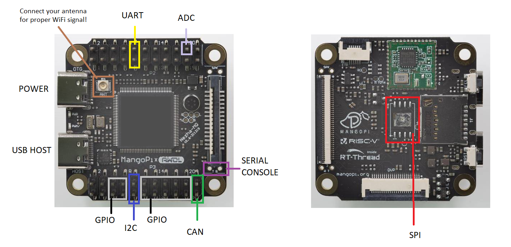
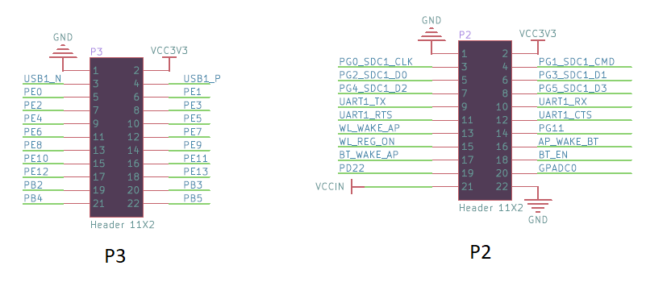
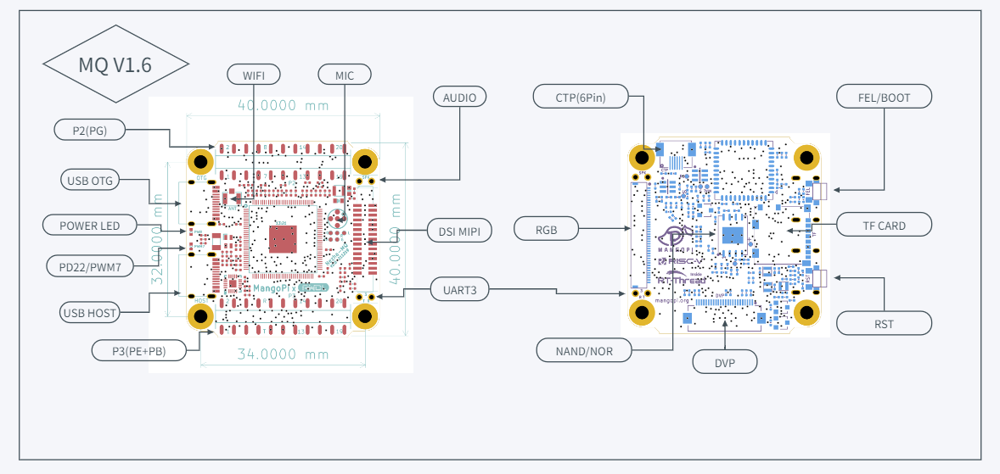

# mangopi-mq-riscv-images

Small linux system image (ca. 30MB compressed) for MangoPi MQ F133/D1s board. System was built using the customized buildroot configuration.

Login:
```
u:root
pwd: mangopi
```

Default Wifi configuration:
```
# cat /etc/wpa_supplicant.conf
ap_scan=1

network={
        ssid="YOURSSID"
        scan_ssid=1
        key_mgmt=WPA-PSK
        psk="YOURPASSWD"
}
```
To generate encrypted password:
```
# wpa_passphrase yourssid yourpasswd
```
Replace your plaintext password in /etc/wpa_supplicant.conf

When Wifi is configured restart networking and check your ip after a moment:
```
# /etc/init.d/S40network restart
# ip a
```
Now you can login via `ssh` also.

What the system includes:
* linux kernel 6.6.0-rc7 riscv64
* swap memory support - you may run low on RAM!
* ssh server (dropbear)
* python 3.11.6 with modules `libevdev` `spidev` `smbus_cffi` `serial` `requests` `can`
* preinstalled CA certificates
* `nano` text editor
* vfat/exfat/ext2 support and tools
* `htop` and `iotop` for monitoring
* simple demo scripts under `/root`

Activated interfaces:
<br>
<div align="center">

</div>
<br>
Header pin names:
<br>
<div align="center">

</div>
<br>
Original board description:
<br>
<div align="center">

</div>
<br>
<hr>

Kernel:
```
# uname -a
Linux mangopi 6.6.0-rc7 #2 PREEMPT Fri Oct 27 19:59:30 EEST 2023 riscv64 GNU/Linux
```

Free RAM after reboot (64MB total):
```
# free
              total        used        free      shared  buff/cache   available
Mem:          45588       15908        6392          56       23288       26040
Swap:             0           0           0
```

Default storage:
```
# df -h
Filesystem                Size      Used Available Use% Mounted on
/dev/root               336.7M     76.3M    238.0M  24% /
devtmpfs                 21.2M         0     21.2M   0% /dev
tmpfs                    22.3M         0     22.3M   0% /dev/shm
tmpfs                    22.3M     24.0K     22.2M   0% /tmp
tmpfs                    22.3M     32.0K     22.2M   0% /run
```

CPU:
```
# cat /proc/cpuinfo
processor       : 0
hart            : 0
isa             : rv64imafdc_zicntr_zicsr_zifencei_zihpm
mmu             : sv39
uarch           : thead,c906
mvendorid       : 0x5b7
marchid         : 0x0
mimpid          : 0x0
```

iomem:
```
# cat /proc/iomem
02000000-020007ff : 2000000.pinctrl pinctrl@2000000
02001000-02001fff : 2001000.clock-controller clock-controller@2001000
02500400-0250041f : serial
02500c00-02500c1f : serial
02502800-02502bff : 2502800.i2c i2c@2502800
02504400-025047ff : 2504400.can can@2504400
03000000-03000fff : 3000000.syscon syscon@3000000
03002000-03002fff : 3002000.dma-controller dma-controller@3002000
03006000-03006fff : 3006000.efuse efuse@3006000
03040000-030407ff : 3040000.crypto crypto@3040000
04020000-04020fff : 4020000.mmc mmc@4020000
04021000-04021fff : 4021000.mmc mmc@4021000
04025000-04025fff : 4025000.spi spi@4025000
04100400-041004ff : 4100400.phy phy_ctrl
04101800-041018ff : 4100400.phy pmu0
04200000-042000ff : 4200000.usb usb@4200000
04200400-042004ff : 4200400.usb usb@4200400
04200800-042008ff : 4100400.phy pmu1
05451000-05451fff : 5451000.phy phy@5451000
06011000-0601101f : 6011000.watchdog watchdog@6011000
07001000-07001fff : 7001000.power-controller power-controller@7001000
07010000-070103ff : 7010000.clock-controller clock-controller@7010000
07090000-070903ff : 7090000.rtc rtc@7090000
40000000-4003ffff : Reserved
40040000-43ffffff : System RAM
  40201000-415639a7 : Kernel image
    40201000-409cddb1 : Kernel code
    40e00000-411fffff : Kernel rodata
    41400000-414f6cb7 : Kernel data
    414f7000-415639a7 : Kernel bss
```

Devices:
```
# cat /proc/devices
Character devices:
  1 mem
  4 /dev/vc/0
  4 tty
  4 ttyS
  5 /dev/tty
  5 /dev/console
  5 /dev/ptmx
  7 vcs
 10 misc
 13 input
 29 fb
 89 i2c
128 ptm
136 pts
153 spi
180 usb
189 usb_device
226 drm
248 rpmb
249 watchdog
250 iio
251 rtc
252 rpmsg_ctrl
253 rpmsg_char
254 gpiochip

Block devices:
  7 loop
179 mmc
259 blkext
```

Network devices:
```
# ip a
1: lo: <LOOPBACK,UP,LOWER_UP> mtu 65536 qdisc noqueue state UNKNOWN group default qlen 1000
    link/loopback 00:00:00:00:00:00 brd 00:00:00:00:00:00
    inet 127.0.0.1/8 scope host lo
       valid_lft forever preferred_lft forever
    inet6 ::1/128 scope host proto kernel_lo
       valid_lft forever preferred_lft forever
2: sit0@NONE: <NOARP> mtu 1480 qdisc noop state DOWN group default qlen 1000
    link/sit 0.0.0.0 brd 0.0.0.0
3: can0: <NOARP,ECHO> mtu 16 qdisc noop state DOWN group default qlen 10
    link/can
4: wlan0: <NO-CARRIER,BROADCAST,MULTICAST,UP> mtu 1500 qdisc mq state DOWN group default qlen 1000
    link/ether 68:b9:d3:xx:xx:xx brd ff:ff:ff:ff:ff:ff
```

Contents of the /root folder:
```
# ls -l
total 11
-rw-r--r--    1 root     root           104 Oct 26  2023 create_128mb_swap.sh
-rw-r--r--    1 root     root          1278 Oct 27  2023 gpio-led-demo.py
-rw-r--r--    1 root     root          7840 Oct 26  2023 i2c-ssd1306-oled-demo.py
```

Python:
```
# python
Python 3.11.6 (main, Oct 27 2023, 15:20:41) [GCC 12.3.0] on linux
Type "help", "copyright", "credits" or "license" for more information.
>>>
```

Connecting the USB memory stick:
```
# [  653.249673] usb 1-1: new high-speed USB device number 2 using ehci-platform
[  653.461355] Block layer SCSI generic (bsg) driver version 0.4 loaded (major 247)
[  653.570434] SCSI subsystem initialized
[  653.599061] usb-storage 1-1:1.0: USB Mass Storage device detected
[  653.606817] scsi host0: usb-storage 1-1:1.0
[  653.612019] usbcore: registered new interface driver usb-storage
[  654.627593] scsi 0:0:0:0: Direct-Access     SanDisk  SanDisk 3.2 Gen1 DL17 PQ: 0 ANSI: 6
[  654.697076] sd 0:0:0:0: [sda] 126124032 512-byte logical blocks: (64.6 GB/60.1 GiB)
[  654.706245] sd 0:0:0:0: [sda] Write Protect is off
[  654.715681] sd 0:0:0:0: [sda] Write cache: disabled, read cache: enabled, doesn't support DPO or FUA
[  654.860635]  sda: sda1
[  654.863813] sd 0:0:0:0: [sda] Attached SCSI removable disk
```

Mount:
```
# mkdir /mnt/disk
# mount /dev/sda1 /mnt/disk/
# df -h
Filesystem                Size      Used Available Use% Mounted on
/dev/root               336.7M     76.3M    238.0M  24% /
devtmpfs                 21.2M         0     21.2M   0% /dev
tmpfs                    22.3M         0     22.3M   0% /dev/shm
tmpfs                    22.3M     28.0K     22.2M   0% /tmp
tmpfs                    22.3M     32.0K     22.2M   0% /run
/dev/sda1                60.1G     35.7G     24.5G  59% /mnt/disk
```

Default list of processes after reboot:
```
# ps aux
PID   USER     COMMAND
    1 root     init
    2 root     [kthreadd]
    3 root     [pool_workqueue_]
    4 root     [kworker/R-rcu_g]
    5 root     [kworker/R-rcu_p]
    6 root     [kworker/R-slub_]
    7 root     [kworker/R-netns]
    8 root     [kworker/0:0-rcu]
    9 root     [kworker/0:0H-ev]
   10 root     [kworker/0:1-eve]
   11 root     [kworker/u2:0-ev]
   12 root     [kworker/R-mm_pe]
   13 root     [rcu_tasks_kthre]
   14 root     [rcu_tasks_trace]
   15 root     [ksoftirqd/0]
   16 root     [rcu_preempt]
   17 root     [kdevtmpfs]
   18 root     [kworker/R-inet_]
   19 root     [kworker/u2:1-ev]
   20 root     [kauditd]
   21 root     [khungtaskd]
   22 root     [oom_reaper]
   23 root     [kworker/R-write]
   24 root     [kcompactd0]
   25 root     [kworker/R-kbloc]
   26 root     [watchdogd]
   27 root     [kworker/0:1H-mm]
   28 root     [kworker/R-rpcio]
   29 root     [kworker/R-xprti]
   30 root     [kworker/R-cfg80]
   31 root     [kswapd0]
   32 root     [kworker/R-nfsio]
   33 root     [kworker/0:2-pm]
   34 root     [3040000.crypto-]
   35 root     [3040000.crypto-]
   36 root     [3040000.crypto-]
   37 root     [3040000.crypto-]
   38 root     [hwrng]
   39 root     [kworker/R-mld]
   40 root     [kworker/R-ipv6_]
   41 root     [kworker/u2:2-ev]
   42 root     [irq/210-sunxi-m]
   43 root     [kworker/u2:3-ev]
   44 root     [irq/211-sunxi-m]
   45 root     [kworker/u2:4-ev]
   48 root     [irq/147-4020000]
   50 root     [kworker/0:3-rcu]
   51 root     [kworker/R-mmc_c]
   52 root     [jbd2/mmcblk0p1-]
   53 root     [kworker/R-ext4-]
   72 root     /sbin/syslogd -n
   76 root     /sbin/klogd -n
   88 root     /sbin/mdev -df
   97 root     [spi0]
   99 root     [kworker/0:4-eve]
  102 root     [ksdioirqd/mmc1]
  117 root     [RTW_XMIT_THREAD]
  118 root     [RTW_CMD_THREAD]
  119 root     [RTWHALXT]
  130 root     udhcpc -t1 -A3 -b -R -O search -O staticroutes -p /var/run/udhcp
  134 root     /usr/sbin/wpa_supplicant -B -i wlan0 -c /etc/wpa_supplicant.conf
  138 root     /usr/sbin/dropbear -R
  139 root     -sh
  157 root     ps aux
```
